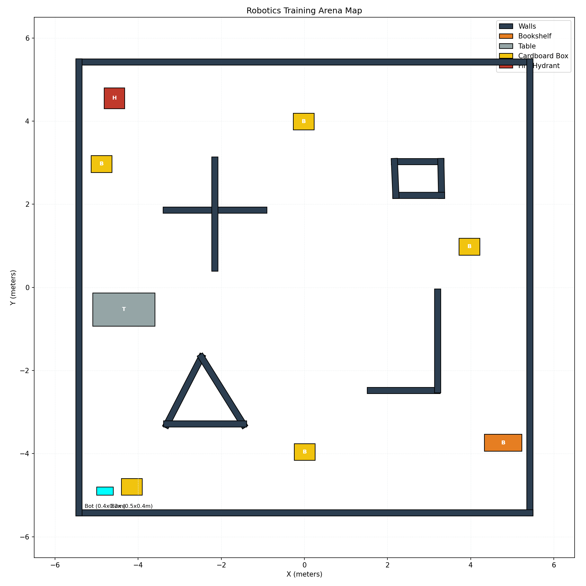

# Bot and World Technical Specifications

This document details the geometry, dimensions, and configuration of the robot and its environment as defined in the source files.

## 1. Robot Specifications (Mogi Bot Mecanum)

### 1.1 Physical Dimensions
| Component | Dimension | Value |
|-----------|-----------|-------|
| Chassis (base_link) | Box (L x W x H) | 0.4m x 0.2m x 0.1m |
| Wheel Separation | Width | 0.3m |
| Wheelbase | Length | 0.3m |
| Wheel Radius | Radius | 0.1m |
| Lidar Height | From ground | ~0.25m |
| Mass | Chassis + Wheels | ~230 kg |

### 1.2 Relative Scale Comparison
| Object | Dimensions (L x W) | Area | Ratio to Bot |
|:-------|:-------------------|:-----|:-------------|
| **Robot** | **0.4m x 0.2m** | **0.08 m²** | **1.0x** |
| Corridor Width | ~0.9m to 1.2m | N/A | ~3-4x wider |
| Cardboard Box | 0.5m x 0.4m | 0.20 m² | 2.5x larger |
| Fire Hydrant | 0.5m x 0.5m | 0.25 m² | 3.1x larger |
| Table Leg | 0.04m (diam) | ~0.001 m² | Tiny |
| Arena | 10.8m x 10.8m | 117 m² | 1460x larger |

### 1.3 Lidar Sensor Geometry (scan_link)
The LIDAR is mounted centrally on top of the chassis.
- **Position (xyz):** `(0.0, 0.0, 0.15)` relative to the chassis center.
- **Update Rate:** 30 Hz
- **Field of View (FOV):** 360° (full circular scan)
- **Angular Range:** -3.14156 to +3.14156 radians
- **Samples:** 720 points per scan (~0.5° resolution)
- **Range:** 0.05m (Min) to 10.0m (Max)
- **Noise:** Gaussian (stddev: 0.01)

### 1.3 Kinematics
- **Type:** Mecanum Drive (4-wheel omnidirectional)
- **Plugin:** `gz-sim-mecanum-drive-system`
- **Topics:** `cmd_vel` (input), `odom` (output)

---

## 2. World Configuration (world.sdf)

### 2.1 World Geometry
The training environment is a large indoor "box" model containing various rooms and obstacles.

| Feature | Dimension | Value |
|---------|-----------|-------|
| Main Boundary | Square Outer Walls | ~10.85m x 10.85m |
| Wall Height | Outer Walls | 2.0m |
| Wall Thickness | Typical | 0.15m |
| Ground Plane | Infinity/Extended | 100m x 100m |

### 2.2 Obstacles and Layout

#### Visual Map

This map is automatically generated from the `world.sdf` file, showing the precise location of:
- **Walls (Dark Blue):** Physical barriers (Outer boundary and internal partitions).
- **Furniture:** Bookshelf (Orange) and Table (Grey).
- **Obstacles:** Cardboard Boxes (Yellow) and Fire Hydrant (Red).

#### Object Coordinate Table
The following table lists the precise starting locations (X, Y) and orientations (Yaw) of major objects in the world.

| Model Name | Position (X, Y) | Orientation (Yaw) | Description |
|------------|-----------------|-------------------|-------------|
| **Outer Boundary** | (0, 0) | 0.0 | ~10.8m x 10.8m Square |
| bookshelf | (4.78, -3.73) | 0.0 | Large static shelf |
| table | (-4.34, -0.53) | 0.0 | Static table obstacle |
| cardboard_box_0 | (3.97, 0.98) | 0.0 | Dynamic box |
| cardboard_box_1 | (0.01, -3.96) | 0.0 | Dynamic box |
| cardboard_box_2 | (-4.88, 2.97) | 0.0 | Dynamic box |
| cardboard_box_3 | (-0.02, 3.99) | 0.0 | Dynamic box |
| fire_hydrant | (-4.57, 4.55) | 0.0 | Small static obstacle |

#### Detailed Wall Coordinates
| Wall Name | X (m) | Y (m) | Yaw (rad) | Length (m) |
|:---|:---|:---|:---|:---|
| **Outer Walls** | | | | |
| Wall_6 (Top) | 0.000 | 5.425 | 0.000 | 11.000 |
| Wall_7 (Right) | 5.425 | 0.000 | -1.571 | 11.000 |
| Wall_8 (Bottom) | 0.000 | -5.425 | 3.142 | 11.000 |
| Wall_9 (Left) | -5.425 | 0.000 | 1.571 | 11.000 |
| **Internal Walls** | | | | |
| Wall_11 | -2.152 | 1.857 | 0.000 | 2.500 |
| Wall_13 | -2.155 | 1.764 | -1.571 | 2.750 |
| Wall_15 | 2.724 | 3.029 | 0.000 | 1.268 |
| Wall_16 | 3.292 | 2.622 | -1.550 | 0.965 |
| Wall_17 | 2.750 | 2.214 | 3.142 | 1.250 |
| Wall_18 | 2.183 | 2.622 | 1.614 | 0.965 |
| Wall_24 | -2.896 | -2.491 | 1.095 | 1.977 |
| Wall_25 | -1.971 | -2.491 | -1.013 | 2.064 |
| Wall_26 | -2.390 | -3.285 | 3.142 | 2.000 |
| Wall_28 | 2.388 | -2.480 | 0.000 | 1.750 |
| Wall_29 | 3.206 | -1.288 | 1.571 | 2.500 |

### 2.3 Physics Engine Settings
- **Engine:** ODE (Open Dynamics Engine)
- **Step Size:** 0.004s (4ms)
- **Update Rate:** 250 Hz
- **Gravity:** -9.8 m/s² (z-axis)

---

## 3. Training Guide References
- **State Space (Lidar perspective):** The agent receives 20 sampled rays from the 720 available points, effectively downsampling the 360° scan into 20 inputs for the neural network.
- **Proximity Awareness:** Pre-calculated "danger zones" (front, left, right) are derived from the same LIDAR perspective to assist in collision avoidance learning.
